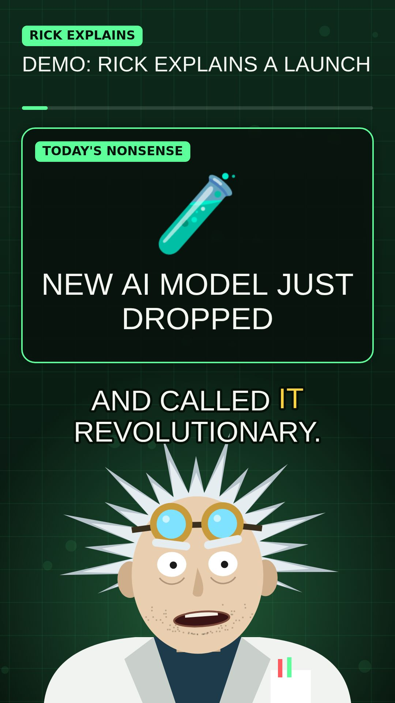

# Rick Explains

Paste a link to an article or announcement and get back a 9:16 short video in which Rick, a cranky genius scientist, translates it into normal human language. It's built for AI news, where half the announcements need translating.



## What a video contains

- **Hook:** what happened, in one sentence.
- **THEY SAID / TRANSLATION:** the jargon is quoted, crossed out, and rewritten in plain English. This is the main bit.
- **Stat** and **list** cards for the key number and the takeaways.
- **Verdict:** a 0–10 "worth caring" meter.
- Word-by-word captions, a talking animated character, and an occasional synthesized burp.

## How it works

```
link or text ─▶ /api/extract ─▶ /api/script ─▶ /api/tts (per beat) ─▶ browser renders + records
                 Readability      Claude          ElevenLabs or          canvas 1080×1920 @30fps
                                  (JSON schema)   OpenAI TTS             MediaRecorder → MP4/WebM
```

1. **Extract** (`server.js`): the server downloads the page and pulls out the article text with Mozilla Readability. Pasted text skips this step.
2. **Script** (`script.js`): Claude writes a list of "beats" that must match a strict JSON schema. The system prompt keeps Rick's facts tied to the article (no invented numbers or quotes) and keeps him an original character.
3. **Edit:** the page shows every beat so you can fix anything before rendering.
4. **Voice:** each beat's narration is sent to TTS on its own, which gives exact timing for every line.
5. **Render** (`public/renderer.js`): the browser draws every frame procedurally on a canvas (no image assets), lip-syncs the mouth to the audio volume, and records canvas and audio together with `MediaRecorder`. Chrome and Edge produce MP4. Browsers without MP4 recording produce WebM.

Rendering happens in real time, so a 60-second video takes about 60 seconds. Keep the tab in front while it renders, because background tabs throttle animation.

## Run it

Requires Node 22.9 or newer.

```bash
npm install
cp .env.example .env   # then fill in keys
npm start              # http://localhost:3000
```

| Env var | Needed? | What it does |
|---|---|---|
| `ANTHROPIC_API_KEY` | For real scripts | Without it, the app runs in **demo mode** with a built-in sample script, so you can still try the renderer. |
| `ELEVENLABS_API_KEY` | One voice key, optional | Best voice quality. Set `ELEVENLABS_VOICE_ID` to pick or design a voice. |
| `OPENAI_API_KEY` | One voice key, optional | `gpt-4o-mini-tts` with a gravelly-scientist style prompt. |
| `CLAUDE_MODEL` | No | Defaults to `claude-opus-5`. |

With no voice key, videos have captions and a mouth-flap animation but no audio.

**About the voice:** Rick is meant to have the *vibe* of a cranky cartoon genius. Don't clone a real actor's voice. Design your own voice (ElevenLabs Voice Design works well for this) and put its ID in `ELEVENLABS_VOICE_ID`.

## Project layout

```
server.js           Express server: /api/config, /api/extract, /api/script, /api/tts
script.js           JSON schema, Rick's system prompt, demo script
public/index.html   The page: paste → edit script → render → download
public/app.js       UI flow
public/renderer.js  Canvas scene, character, captions, burp synth, recording
```

## Customizing

- **Rick's personality:** edit `SYSTEM_PROMPT` in `script.js`.
- **New card types:** add the kind to the schema enum in `script.js`, then add a `case` in `drawBeat()` in `renderer.js`.
- **Look:** change the colours in the `C` object at the top of `renderer.js`. The character is drawn in `drawRick()`.
- **Pacing:** `WORDS_PER_SEC`, `GAP` and `TAIL` in `renderer.js`, and the length picker in the UI.

## Known limits

- Paywalled pages and JavaScript-only pages often can't be extracted. Some sites block bots too. For those, paste the text instead.
- Articles over about 400K characters are rejected rather than silently truncated.
- The MP4/WebM format depends on what the browser's `MediaRecorder` supports.
- Scripts are AI-written. Rick is told to stick to the source, but check anything important before you post it.

## Ideas / roadmap

- Server-side rendering (headless Chromium or Remotion) so rendering doesn't need an open tab and can run as a batch job.
- A "today's AI news" mode that pulls a few RSS feeds and makes one video per story.
- Word-level timestamps from the TTS provider for exact caption sync.
- Pulling images and logos from the article onto the cards.
